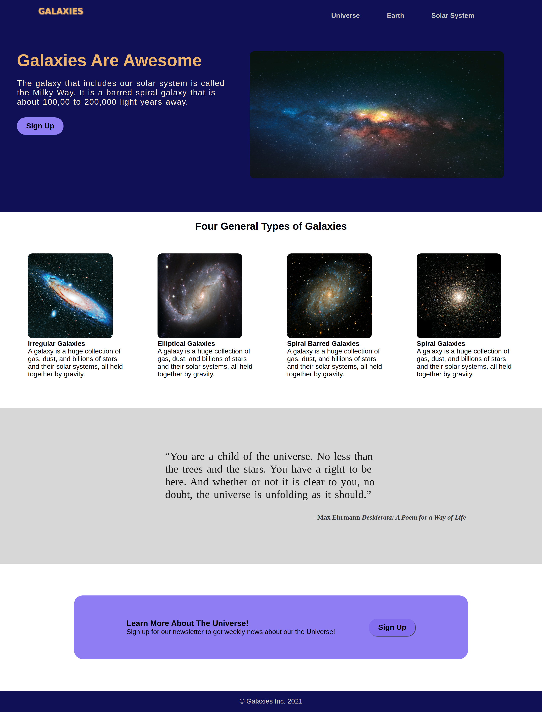
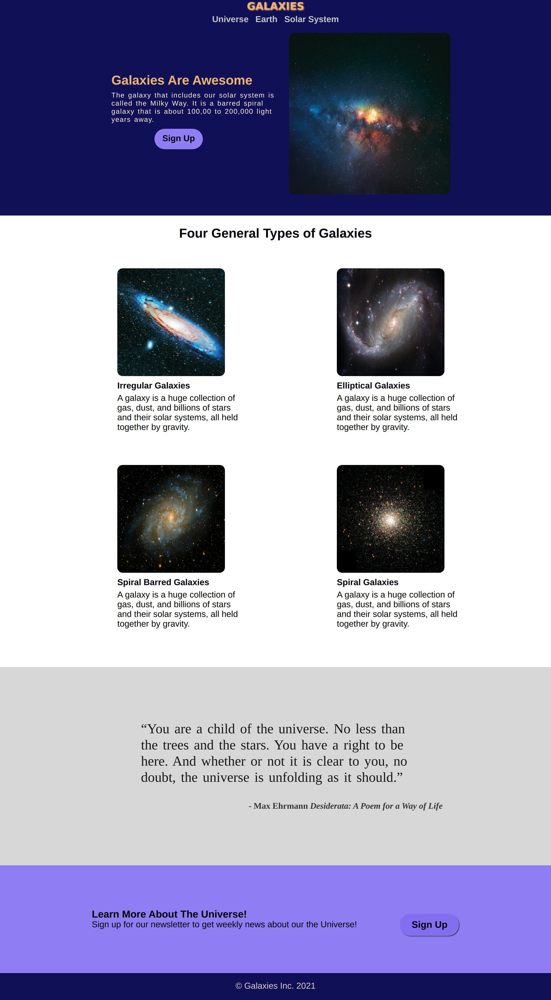
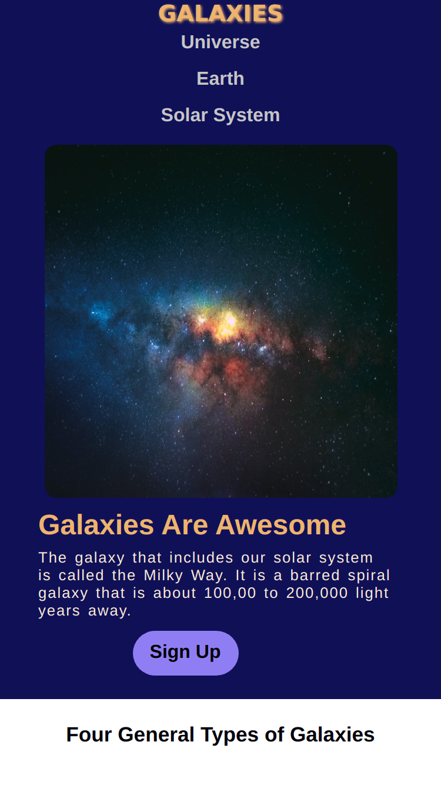
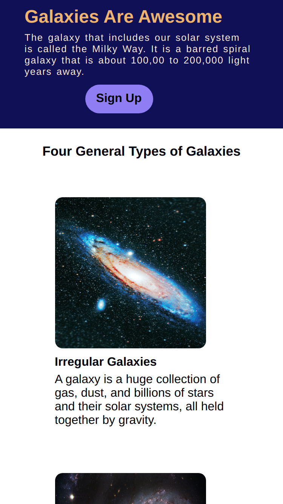
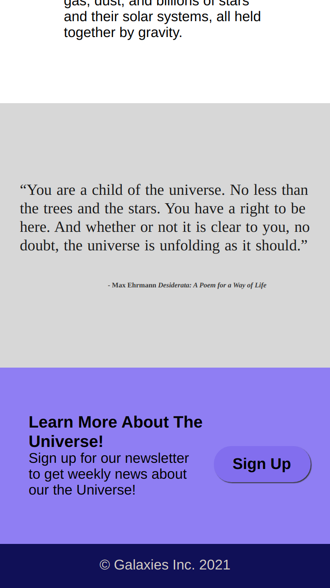

# Galaxies Landing Page 

### Description:

This landing page was created for the "Landing Page" assignment in the Odin Project, and it was created using HTML and CSS. The assignment was to create a landing page using a very basic template, I took liberties in the design of the page, and created the *Galaxies Landing Page*. Initially, this landing page was not meant to be mobile first, but after creating the web version of the landing page, I decided to create the mobile version of it, so it is fully responsive. 

The images used for this assignment are from [Unsplash](https://unsplash.com/), the information from the text in the hero section, and the text acccompanying the galaxy images are from [NASA Space Place](https://spaceplace.nasa.gov/galaxy/en/#:~:text=The%20Short%20Answer%3A,part%20of%20our%20solar%20system.), and the quote by Max Erhamm is from [GoodReads, Inc.](https://www.goodreads.com/quotes/16855-you-are-a-child-of-the-universe-no-less-than) 

<table>
    <tr>
    <td></td> 
    <td></td>
    </tr>
</table>

<table>
    <tr>
    <td></td> 
    <td></td>
     <td></td>
    </tr>
</table>

**Sources:**

[Unsplash](https://unsplash.com/)

[NASA Space Place](https://spaceplace.nasa.gov/galaxy/en/#:~:text=The%20Short%20Answer%3A,part%20of%20our%20solar%20system.)

[GoodReads, Inc.](https://www.goodreads.com/quotes/16855-you-are-a-child-of-the-universe-no-less-than)

[Github icons created by Laisa Islam Ani - Flaticon](https://www.flaticon.com/free-icons/github)

**Odin Project**

[Odin Recipes Homepage](https://www.theodinproject.com/)
